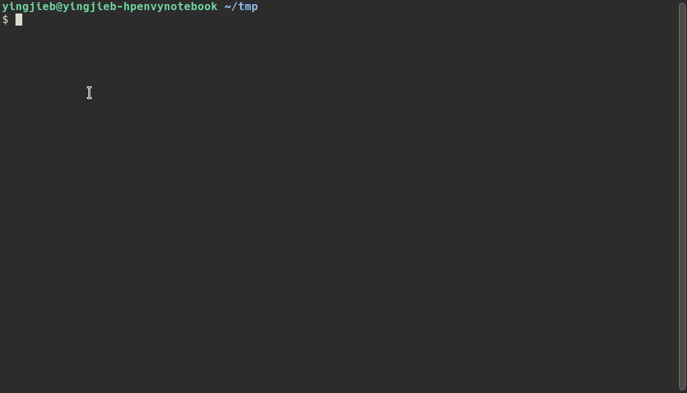

# Introduction

grepo is the central repo for gshell based apps/services, see godevsig/gshellos
for details.

# Examples

To be able to run grepo apps, a `gshell daemon` should already be started on the system.

## topid and topid chart

topid is a tool that collects linux process statistic data like top, periodically sends
the data to topid chart server which then draws the CPU usage and MEM usage chart that
can be viewed in web.

[topid usage](perf/topid/README.md)

[topid chart usage](perf/topidchart/cmd/README.md)

