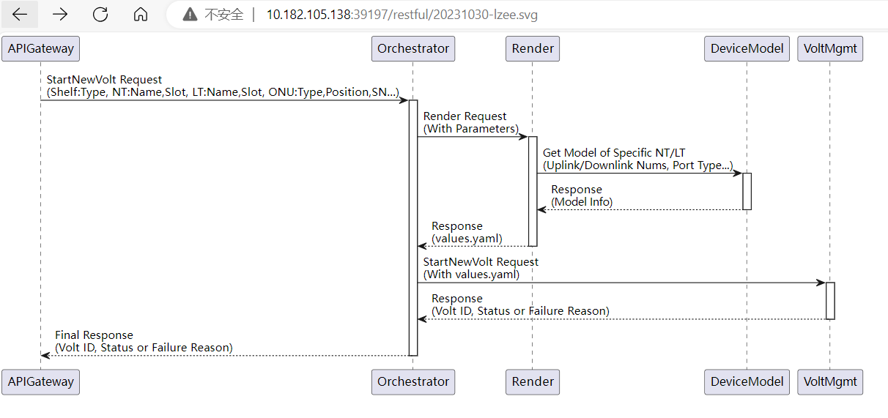
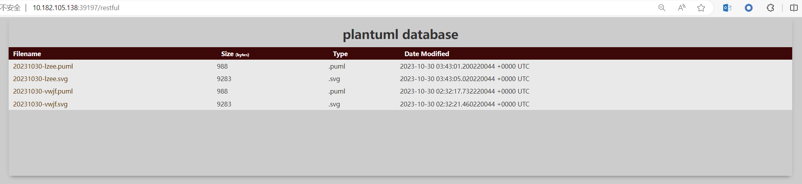
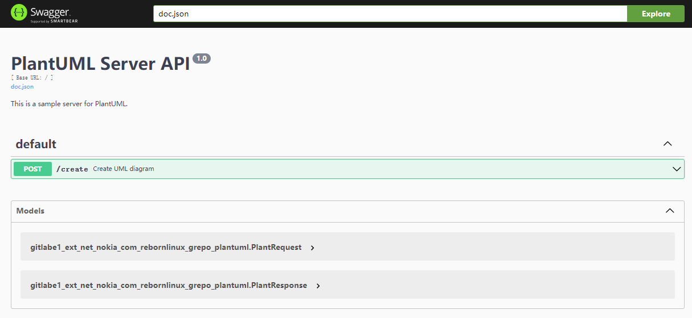
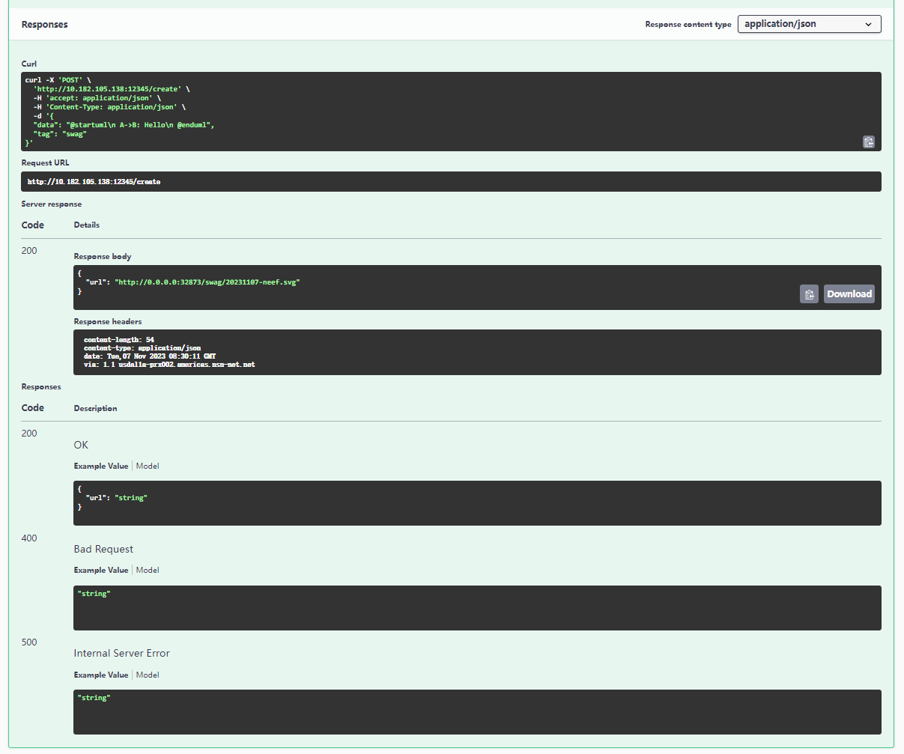

# plantuml

## Table of Contents

- [plantuml](#plantuml)
	- [Table of Contents](#table-of-contents)
	- [Overview](#overview)
	- [Usage](#usage)
		- [run server](#run-server)
		- [run client](#run-client)
			- [gshell interface example](#gshell-interface-example)
			- [RESTful interface example](#restful-interface-example)
			- [get image from returned url](#get-image-from-returned-url)
			- [plantuml database](#plantuml-database)
	- [Docs](#docs)
		- [API](#api)
		- [Try it out](#try-it-out)
	- [License](#license)
	- [Acknowledgments](#acknowledgments)


## Overview
The `plantuml` project, is designed to deployed plantuml locally.
- [plantuml](https://plantuml.com/) is a versatile component that enables swift and straightforward diagram creation. Users can draft a variety of diagrams using a simple and intuitive language.
- This project provides a gshell interface and a RESTful API to generate diagrams from text.

## Usage

### run server
```
gshell run plantuml/server/plantuml.go -h
Usage:
  -hostport string
        set server port, default 0 means alloced by net Listener (default "0")
  -logLevel string
        debug/info/warn/error (default "info")
  -restport string
        set restful api port, default 8364 (default "8364")
  -workdir string
        directory path of workdir, used to save plantuml jar, text and svg. (default "/tmp/plantuml") (default "/tmp/plantuml")
```

```
gshell run plantuml/server/plantuml.go -logLevel debug -restport 12345 -workdir /repo/chaowang/plantuml_database
```

### run client

#### gshell interface example
```
const data = `@startuml
	!define RECTANGLE class

	participant "APIGateway" as APIGateway
	participant "Orchestrator" as Orchestrator
	participant "VoltMgmt" as VoltMgmt

	APIGateway -> Orchestrator : GetVoltStatus Request  (with parameters: VoltID)
	activate Orchestrator

	Orchestrator -> VoltMgmt : GetVoltStatus Request to the "dindInVM" voltmgmt instance\n(with parameters: VoltID)
	activate VoltMgmt

	VoltMgmt -> VoltMgmt :
	note right: go voltmgmt.GetVoltStatus(VoltID, callback)


	VoltMgmt --> Orchestrator : Response\n(VoltID, Status)
	deactivate VoltMgmt

	Orchestrator --> APIGateway : Final Response\n(VoltID, Status)
	deactivate Orchestrator
	@enduml`

func main() {
	c := as.NewClient().SetDiscoverTimeout(0)
	conn := <-c.Discover("platform", "plantuml")

	if conn != nil {
		plantRequest := plantuml.PlantRequest{Tag: "test", Data: data}
		var plantResponse plantuml.PlantResponse
		if err := conn.SendRecv(&plantRequest, &plantResponse); err != nil {
			fmt.Println(err)
		}
		fmt.Printf("visit this web page to get the image --> %v\n", plantResponse.URL)

		conn.Close()
	}
}
```

```
gshell run plantuml/client/client.go
visit this web page to get the image --> http://10.182.105.138:39197/test/20231030-krmi.svg
```

#### RESTful interface example
```
curl -X POST  http://10.182.105.138:12345/create -H "Content-Type: application/json" -d @image.json
{"url":"http://10.182.105.138:39197/restful/20231030-lzee.svg"}
```

#### get image from returned url


#### plantuml database



## Docs

### API


### Try it out


## License

For open source projects, say how it is licensed.

## Acknowledgments

Show your appreciation to those who have contributed to the project.
